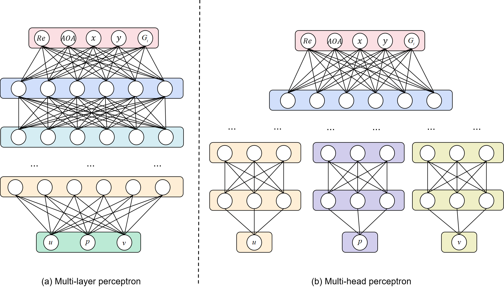

# Multi-head-attention-network

>Based on the UIUC database, the relevant airfoil parameterization work is carried out：[UIUC Airfoil Data Site (illinois.edu)](https://m-selig.ae.illinois.edu/ads/coord_database.html)

    

    

1、`airfoil_interpolate.py` used to interpolate scattered airfoil coordinates into 70 uniform coordinate data

2、First run `get_xy_coordinate.py` get x,y coordinates of the interpolated different airfoils

3、Run `get_x_coordinate_averge.py` get a fixed x-coordinate along the airfoil chord length

4、Because the image drawn by Python is in ARGB format, it is necessary to run `convertGray2.py` convert it to a single-channel grayscale image

5、`get_train_files.py` get the deep learning model training file

6、Run the `CNN_train.py` file to train the model

7、Run the `CNN_test.py` file to train the model

8、A similar file that begins with mlp represents code related to MLP flow field prediction

9、A similar file that begins with mha represents code related to MHA-net flow field prediction
